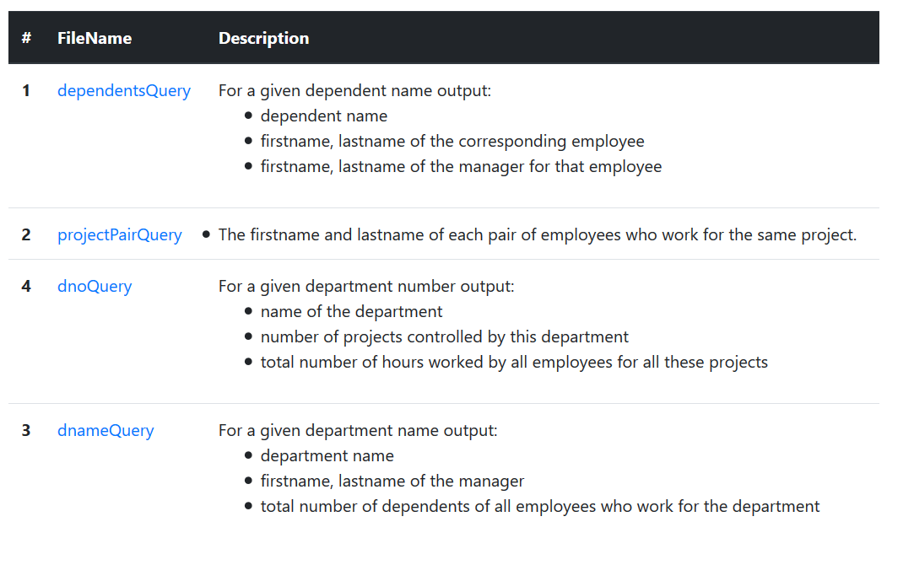
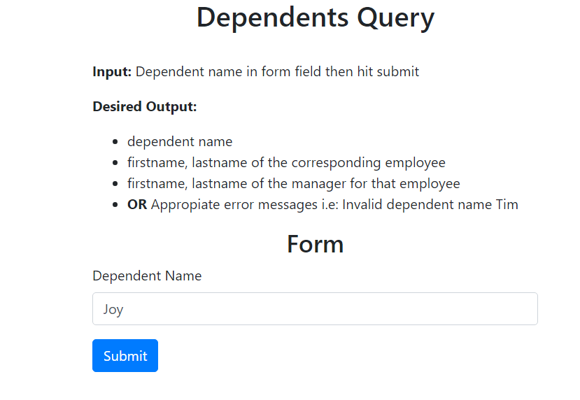

# php-bootstrap-basics
running through connecting php to mysql and solving some begginer/intermediate level queries on a classic 
"company db" leveraged xampp to run environment. Front end done on bootstrap4. 

## Index 

## Form 

